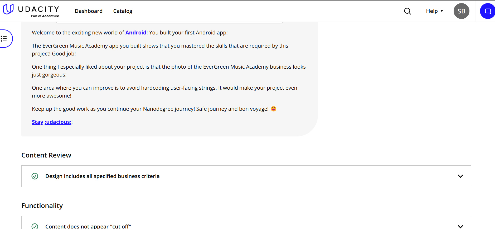
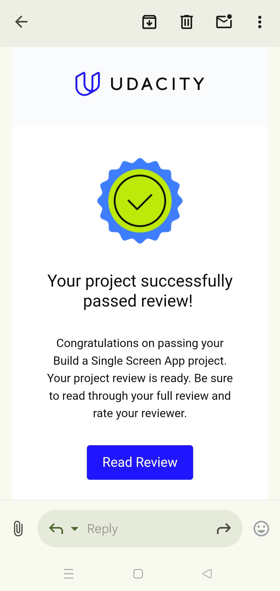

# 📌 Single Screen App: Business Card  

This app was developed as part of the **Android Basics: User Interface** course, a module in the **Udacity Android Basics Nanodegree** program.

## 📌 Project Overview  
Design and implement a **single-screen app** that displays information about a fictional small business.

## ✅ Requirements Followed  
The app design includes the following:  
- **Business Name**  
- **At least one photo representing the business**  
- **Two or more additional details, such as:**  
   - *Contact Information* (Phone, Email, Website)  
   - *Business Address*
   - *Business Description*  
   - *Hours of Operation*

---

## 📱 Screens of the App  
This app contains only **one screen** as it’s a **single-screen app**. It displays the information about **Evergreen Music Academy**, including:  
- **Title & Description**  
- **Address & Contact Information**  
- **Business Hours**  

It features a **beautiful and visually appealing UI design**. The app's UI is **fully responsive**, adapting smoothly to different screen sizes for an optimal viewing experience across devices.

### 🖼️ **Screenshots**
  
  

---

## ⭐ Review from Udacity  

---
